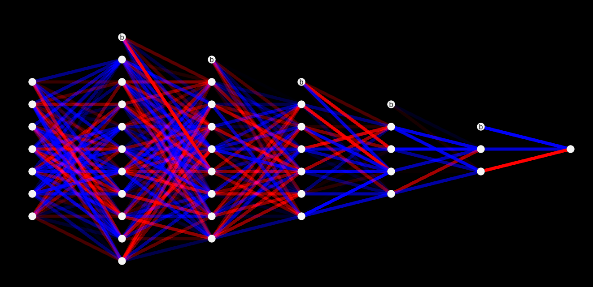
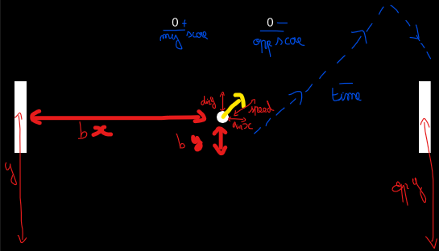

# Machine learning 

This project aims at using Multi-Layered Perceptron (MLP) networks to play games<br/>


## Table of content ## 

 - [Quick Start](#quick-start) 

 - [R&D details](#rd-details) 

 - [Technologies](#technologies) 

 - [Credit](#credit)


## Quick Start ## 

Unity project: 

1. Clone the project from git ``` git clone ``` 

2. Open the project


To play with the trained AI: 

1. Open the ``` PlayScene ``` scene 

2. Press start at the top of screen 

3. Use the Up and Down arrow keys or W and S to move the paddle Up or Down 

If one trained their own AI, they shouldn't forget to change the save file name in the ``` AIManager ``` and also copy the shape of the network in the parameters. 

To train a new AI or further train an existing AI: 

1. Open the ``` TrainingScene ``` scene 

2. Open the inspector view of the ``` AIManager ``` 

3. From there you can tweak the parameters as you like, including but not limited to: the file to which the network will be saved and read from, the size of the network, the genetic selection parameters or if the neural network should be displayed in the background or not.<br/> 

If one wishes to add or remove pong courts of the screen and thus adding or freeing computer ressources, it's possible.


## R&D details ## 

My main goal when developing this AI was to get an AI that can perfectly play Pong at a point it is scary to face. An AI that would only move if necessary and that could score if the tiniest opportunity would have been presented to it. 

I fisrtly developped a tool to help me viewing the changes while the learning process was running.<br/> 

<br/> 

The dots represent neurons and if there is a 'b' inside of it, it's a bias.<br/> 

The colored lines represent the weight of each preceding values, if it's colored in blue then the weight value is below zero and if it's red it's above zero, the alpha value of the color is the absolute value of the weight (a faded line will represent a small weight and a bright one a big one). 

I have made a mistake when implementing my neural network:<br/>
I added a bias on the input layer which naturally broke the simulation as it was considered as a normal input parameter. 

I then start thinking about how I will create an AI that can play Pong.<br/> 

I thought that backpropagation based network wouldn't be suited for such problem as one can't predict which position would be the best for a specific ball position and opponent position thus not allowing to have a precise error computation; and slower to learn so I decided to go with a genetic based one.<br/> 

In order not to wait for to long when training my network I thought of different ways to accelerate the process.<br/> 

I firstly thought to three ways of solving my problem which either involved using several layers of the Unity engine in order to have multiples games playing on the same court or involved to simply shoot balls at random speeds and angles but finally didn't went for one or the other.<br/> 

The solution I used involved using several Pong courts that a global manager will check to know if they had finished playing or not and depending on different fitness evaluation functions, only the fittests will remain to reproduce and breed the new generation. 

I've tried different approches when it come to the genetic algorithm:
- Select a choosen amount of parents between the fittest network and mix their weights to get a new generation and then mutate them and save the previous best parent
- Randomly select between parents and mutate them directly without mixing their weights then add the previous best network
- Randomly select between parents and fill half of the new generation with them, then mix their weights for the other half, and then mutate them also saving the previous best parent 

I'll there explain the different approches I used to compute the fitness score of a network:<br/> 

``` FitnessScore = Score * 100f - AddScoringTime() / 50f - opponent.Score * 10f``` 

At first I wanted to get an agressive AI that prefer to score fast but not defend as much (the AddScoringTime() is a function which adds the amount time the AI had to take in order to score).


``` FitnessScore = HitCount + Score * 10 - opponent.Score```<br/> 

Then I wanted an AI that aims at scoring but also tries to play with its opponent. 

The HitCount variable is the amount of time the ball has hit this paddle during the game.


``` FitnessScore = survivingTime + survivingTime * Score - opponent.Score * 10000f - AddScoringTime()```<br/> 

At last I wanted an AI that prefer to defend than scoring but somewhat gets a bonus treat if it manages to do it. 

The surviving time is the amount of time before the opponent has scored for the first time.


The opponent in these scenarios was a scripted AI found under ```AITrainerController.cs```.<br/> 

I found out that the AI I tried to create was reproducing pretty much what it's opponent was doing and thus the AI trainer was very important for the learning process.<br/> 

I tried five versions of the AI trainer: 

1. a paddle that tries to match the y position of the ball as close as possible 

2. one that goes back and forth to and from the top and bottom of the court with a random speed 

3. a tweaked version of the first version which moreover had a bias to the position where it should go, in order to avoid infinite ball exchange with the AI, only staying in the middle of the court 

4. another version of the first one which went to a random position of the court when the ball was going on the opposite side (at one point my trained AI only copied the position of the trainer paddle, not accounting for the ball position, speed or direction; this trainer was trying to rid of this behavior) 

5. the final version is the fourth version but it stays in place when the ball is going to the opposite side<br/> 

In the process I also tried to train the AI against itself but that didn't go very well.


I also thought of the different inputs that I should provide my network with, here's a little scheme of early development:<br/> 

<br/> 

Here you can see, in red, a total of seven parameters all remapped between 0 and 1 to simplify their usage by the neural network (the vertical position of the paddle, the vertical position of the opponent's paddle, the horizontal and vertical postions of the ball, the horizontal and vertical direction of the ball and its speed). I tried to remove some of them to see if the network would train faster but it didn't seem to change a lot. 

At first, the output value would define wether the paddle should go up or down and at which speed (I added a speed multiplier to the MoveUp and MoveDown function) but it didn't work well so I then opted for the position the paddle should go (0 being the center of the court vertically and -1 and 1 would be the borders). 

An other aspect I have played with is the shape of the neural network itself, at first I went with an X shaped neural network (6-4-6) but I have been advised to use a cone shaped one (10-6-2) in order to firstly process the global inputs and then to be more and more specific regarding the paddle direction to go to, I also tried a linear shape (6-6-6) but neither seemed to work.


As said previouly I firstly went for an agressive AI but finally went for a more balanced one.<br/> 

I could have further improved my Pong AI by changing the input parameters, the shape of the network, the trainer or the fitness function but due to the lack of time I ended up only having a broken one that can barely play Pong.


## Technologies ## 

- Engine :  Unity 2022.3.4f1 

- IDE : Visual Studio 2022 

- Versionning : Git


## Credit ## 

Author : Kristian GOUPIL<br/> 

Special thanks: Jennifer ROIG-DESLANDES, Gautier CARREE, Mael FRANCESCHETTI and Cedric HERPSON<br/>  

From 11-12-2023 to 02-01-2024<br/> 

Done with **ISART DIGITAL**
